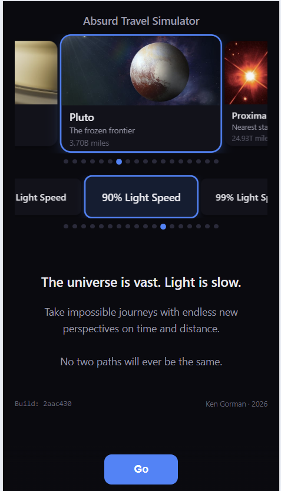
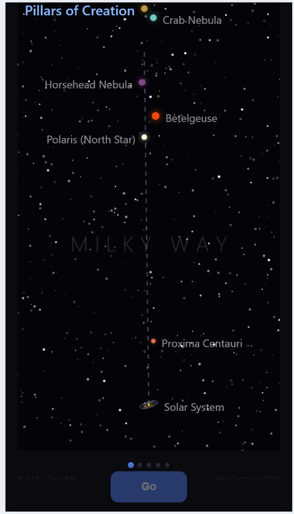
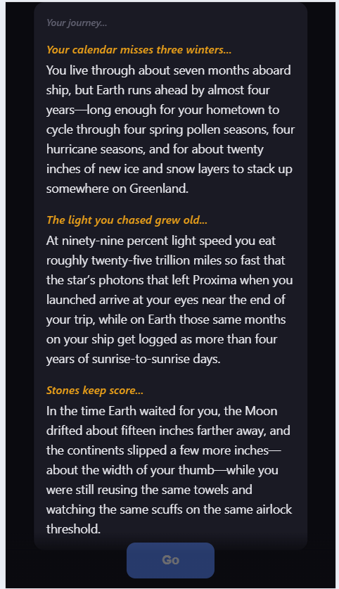
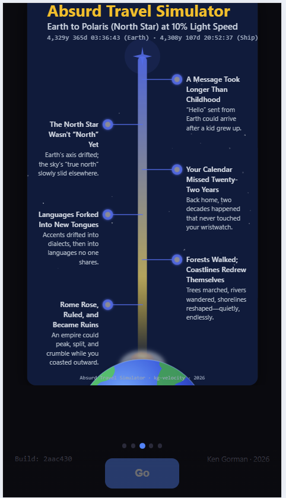
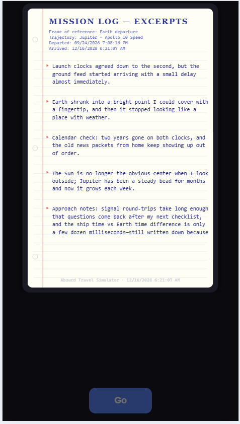
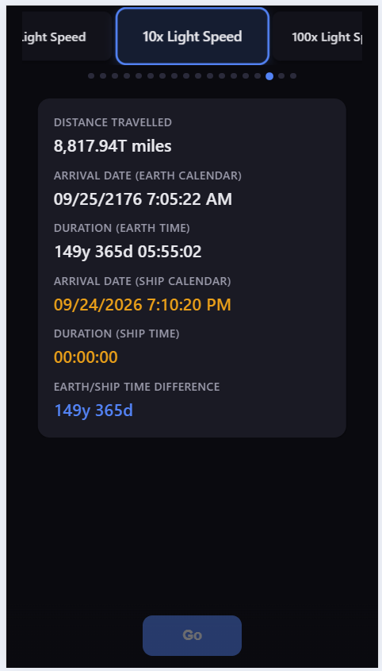

# Absurd Travel Simulator — Relativistic and Fun Travel Simulation

Showing the vastness of space, and in that context the near crawl-speed of light.
See the impact in time and space by going at car speed to Mars, or twice the speed of light to Polaris.
Its intention is to make the user think: "Wow, that is amazing how long a trip from [a] to [b] would really take!"

**Try it live: [absurdtravelsimulator.com](https://www.absurdtravelsimulator.com/)**

<p align="center">
  
</p>

## Project Overview

This repository contains a relativistic physics simulation:

### 🌐 Blazor WebAssembly App (`Kg.Velocity.Blazor`)
The user interface, running in the web browser. It gets trip results and AI content from the API.
- No installation required
- Mostly C# via WebAssembly, with JavaScript for the movie and carousels
- Works on any device with a modern browser
- Tuned for mobile display

### ⚙️ API Backend (`Kg.Velocity.Api`)
An ASP.NET Core server that hosts the web app, works out the trip physics, and asks OpenAI to write the summary, poster events, and mission log.

### 🧮 Shared Physics Library (`Kg.Velocity.Math`)
The core relativity math, used by the API (and the test apps).
- Lorentz factor
- Time dilation (Earth clock vs ship clock)

## Features

- **Realistic Physics** - Accurate special relativity calculations
- **Time Dilation** - See how Earth and ship clocks diverge over long distances based upon speed.
- **Multiple Destinations** - New destinations can be added easily

## What you see

<table>
  <tr>
    <td width="260"></td>
    <td><b>Canvas/JS Movie</b> - Overall view of the journey displayed while content is loaded in the backend.</td>
  </tr>
  <tr>
    <td></td>
    <td><b>Journey Summary</b> - An always-unique summary of the trip in terms of major historic happenings while on the journey.</td>
  </tr>
  <tr>
    <td></td>
    <td><b>Absurd Travel Simulator Poster</b> - An always-unique tree-based poster displaying additional unique, sometimes fun, happenings due to the distance and length of the trip.</td>
  </tr>
  <tr>
    <td></td>
    <td><b>Mission Log</b> - Written from the perspective of the captain of the ship. First person experiences during the journey.</td>
  </tr>
  <tr>
    <td></td>
    <td><b>Data Points</b> - The distance, Earth time and ship time for the trip, the gap between them, and the arrival date by Earth and ship calendars.</td>
  </tr>
</table>

## Local Quick Start

You need the [.NET 9 SDK](https://dotnet.microsoft.com/download) and an API key for OpenAI (or another AI provider, see below).
The key is needed for the AI-written parts (summary, poster, mission log); without it only the trip numbers and movie work.

```bash
dotnet dev-certs https --trust   # first time only, so the browser trusts the local https address
dotnet user-secrets set OpenAI:ApiKey <your-key> --project Kg.Velocity.Api
dotnet run --project Kg.Velocity.Api
```

The browser opens to `https://localhost:5100`. The API serves the web app too, so it's the only thing you need to run.

### Using a different AI provider

The app uses OpenAI by default, but any server that accepts OpenAI-style requests works (Ollama, Groq, OpenRouter, Gemini, ...). These settings control it (how to set them is below):

| Setting | What it does |
|---|---|
| `OpenAI:Endpoint` | The server's address, e.g. `http://localhost:11434/v1` for Ollama. Leave unset for OpenAI. |
| `OpenAI:Model` | The model name, e.g. `llama3.1`. Defaults to `gpt-5.2`. |
| `OpenAI:ApiKey` | That server's key (not needed for most local servers). The key is sent to whichever server is set, so don't leave your OpenAI key in place when switching. |
| `OpenAI:MaxTemperature` | Optional. Set to `1.0` for providers that reject higher values. |

The prompts were tuned on gpt-5.2, so other models will write differently. If a model's reply can't be read, the poster and mission log fall back to built-in text.

#### Setting the values

**On your own machine: user secrets.** These are stored in your user profile, outside the repo, so keys never end up in git.

```bash
# Example: switch to Ollama running locally
dotnet user-secrets set OpenAI:Endpoint http://localhost:11434/v1 --project Kg.Velocity.Api
dotnet user-secrets set OpenAI:Model llama3.1 --project Kg.Velocity.Api
dotnet user-secrets remove OpenAI:ApiKey --project Kg.Velocity.Api

# See what's set (careful: this prints your key)
dotnet user-secrets list --project Kg.Velocity.Api

# Back to OpenAI
dotnet user-secrets remove OpenAI:Endpoint --project Kg.Velocity.Api
dotnet user-secrets remove OpenAI:Model --project Kg.Velocity.Api
dotnet user-secrets set OpenAI:ApiKey <your-openai-key> --project Kg.Velocity.Api
```

**On a server (Azure, Docker, etc.): environment variables.** Use a double underscore where the name has a colon, e.g. `OpenAI__ApiKey`, `OpenAI__Endpoint`, `OpenAI__Model`. In Azure App Service, add these under Settings → Environment variables.

Settings that aren't secret (`OpenAI:Endpoint`, `OpenAI:Model`, `OpenAI:MaxTemperature`) can also go in `Kg.Velocity.Api/appsettings.json`. Never put the key there, because that file is committed.

## Architecture

```
Kg.Velocity.Blazor              # Blazor WebAssembly app (runs in the browser)
└── Kg.Velocity.UI              # Razor pages and components, view model, JS (movie, carousel)
    └── Kg.Velocity.Contracts   # Data shapes shared by the web app and the API

Kg.Velocity.Api                 # ASP.NET Core API: hosts the web app, calls OpenAI, draws SVG posters
├── Kg.Velocity.Contracts
└── Kg.Velocity.Engine          # Trip logic: time formatting, speed presets, insight classifier
    └── Kg.Velocity.Math        # Relativity math: Lorentz factor, time dilation
```

All the physics runs on the server; the browser app only shows the results.

Two small console apps help with testing:
- `Kg.Velocity.InsightTests` - prints what the insight classifier decides for many trips (no AI calls)
- `Kg.Velocity.PosterTests` - prints AI-written poster events for many trips (calls the AI model)

When you press Go, the web app makes two requests at the same time: one for the trip physics (fast, no AI) and one for the AI-written content. The movie plays while the AI content is being written.

## Technology Stack

- **.NET 9 / C#**
- **Blazor WebAssembly** - C# in the browser, hosted by an **ASP.NET Core** API
- **OpenAI** (gpt-5.2) - trip summary, poster events, mission log
- **Scriban** - templates for the SVG poster and mission log
- **Embla Carousel** - swipeable destination/speed pickers and results
- **HTML Canvas** - the trip movie
- **Azure App Service** + **Application Insights**, deployed by **GitHub Actions**

## Physics Implementation

Each trip is a single, constant speed.
- **Earth time** = distance ÷ speed
- **Lorentz factor (γ)** = 1 / √(1 − v²/c²)
- **Ship time** = Earth time ÷ γ. The faster you go, the less time passes for the traveler.
- **Faster than light** - not physically possible, but allowed for fun. The trip is instant for the traveler (ship time 0) while Earth still waits the full distance ÷ speed.

## Building

```bash
dotnet build
dotnet publish Kg.Velocity.Api -c Release   # includes the web app
```

Node.js is only needed if you change the carousel JavaScript (`Kg.Velocity.UI/wwwroot/js/embla-carousel.js`). Rebuild its bundle with:

```bash
npm install
npm run build:embla
```

## How this evolved

- **The trip movie started as standalone prototypes.** The zoom-out animation that plays while the AI text is being written began as three separate HTML pages, one for each scale: the solar system (measured in distances from the Sun), the Milky Way (light-years, spaced on a log scale so near and far stars both fit), and other galaxies (out to Andromeda). We also tried a single animation that zooms through all three scales in one go. It was dropped because each scale had its own hand-tuned look (planet detail, star landmarks, spiral galaxies) that got lost when combined. The three versions now live together in `Kg.Velocity.UI/wwwroot/js/trip-movie.js`, and the app picks one based on the destination.

## License

See LICENSE file for details.

## Contributing

If you're interested in contributing, please contact me at gorman.kenneth@gmail.com or on [LinkedIn](https://www.linkedin.com/in/kengormansoftware/).

## Future Ideas
- [ ] More destinations (black holes, edge of observable universe)
- [ ] Visualization of length contraction
- [ ] Multiple reference frames
- [ ] General relativity effects
- [ ] Journey replay/history

---

**Made with ❤️ to explore the wonders of special relativity**
