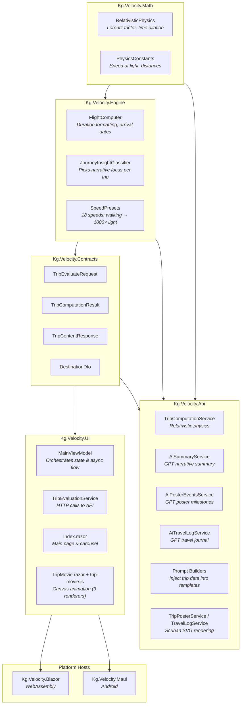
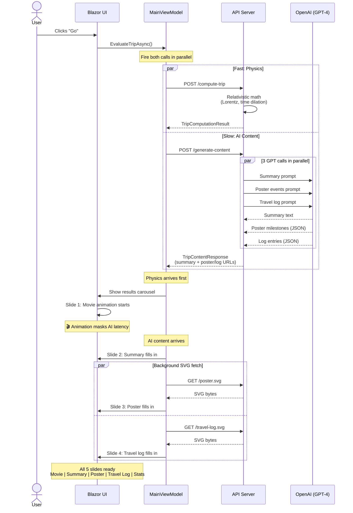

# KG Velocity — Architecture Diagrams

## Project Structure

```mermaid
graph TB
    subgraph Math["Kg.Velocity.Math"]
        RelativisticPhysics["RelativisticPhysics<br/><i>Lorentz factor, time dilation</i>"]
        PhysicsConstants["PhysicsConstants<br/><i>Speed of light, distances</i>"]
    end

    subgraph Engine["Kg.Velocity.Engine"]
        FlightComputer["FlightComputer<br/><i>Duration formatting, arrival dates</i>"]
        InsightClassifier["JourneyInsightClassifier<br/><i>Picks narrative focus per trip</i>"]
        SpeedPresets["SpeedPresets<br/><i>18 speeds: walking → 1000× light</i>"]
    end

    subgraph Contracts["Kg.Velocity.Contracts"]
        TripRequest["TripEvaluateRequest"]
        TripResult["TripComputationResult"]
        TripContent["TripContentResponse"]
        DestinationDto["DestinationDto"]
    end

    subgraph UI["Kg.Velocity.UI"]
        MainViewModel["MainViewModel<br/><i>Orchestrates state & async flow</i>"]
        TripEvalService["TripEvaluationService<br/><i>HTTP calls to API</i>"]
        IndexRazor["Index.razor<br/><i>Main page & carousel</i>"]
        TripMovie["TripMovie.razor + trip-movie.js<br/><i>Canvas animation (3 renderers)</i>"]
    end

    subgraph Api["Kg.Velocity.Api"]
        ComputeService["TripComputationService<br/><i>Relativistic physics</i>"]
        AiSummary["AiSummaryService<br/><i>GPT narrative summary</i>"]
        AiPoster["AiPosterEventsService<br/><i>GPT poster milestones</i>"]
        AiTravelLog["AiTravelLogService<br/><i>GPT travel journal</i>"]
        PromptBuilders["Prompt Builders<br/><i>Inject trip data into templates</i>"]
        SvgRenderers["TripPosterService / TravelLogService<br/><i>Scriban SVG rendering</i>"]
    end

    subgraph Hosts["Platform Hosts"]
        Blazor["Kg.Velocity.Blazor<br/><i>WebAssembly</i>"]
        Maui["Kg.Velocity.Maui<br/><i>Android</i>"]
    end

    Math --> Engine
    Engine --> Contracts
    Contracts --> UI
    Contracts --> Api
    UI --> Blazor
    UI --> Maui
    Engine --> Api
    Math --> Api
```

## Go Button — Async Flow

```mermaid
sequenceDiagram
    actor User
    participant UI as Blazor UI
    participant VM as MainViewModel
    participant API as API Server
    participant GPT as OpenAI (GPT-4)

    User->>UI: Clicks "Go"
    UI->>VM: EvaluateTripAsync()

    Note over VM: Fire both calls in parallel

    par Fast: Physics
        VM->>API: POST /compute-trip
        API->>API: Relativistic math<br/>(Lorentz, time dilation)
        API-->>VM: TripComputationResult
    and Slow: AI Content
        VM->>API: POST /generate-content
        par 3 GPT calls in parallel
            API->>GPT: Summary prompt
            API->>GPT: Poster events prompt
            API->>GPT: Travel log prompt
            GPT-->>API: Summary text
            GPT-->>API: Poster milestones (JSON)
            GPT-->>API: Log entries (JSON)
        end
        API-->>VM: TripContentResponse<br/>(summary + poster/log URLs)
    end

    Note over VM: Physics arrives first

    VM->>UI: Show results carousel
    UI->>UI: Slide 1: Movie animation starts
    Note over UI: 🎬 Animation masks AI latency

    Note over VM: AI content arrives

    VM->>UI: Slide 2: Summary fills in

    par Background SVG fetch
        VM->>API: GET /poster.svg
        API-->>VM: SVG bytes
        VM->>UI: Slide 3: Poster fills in
    and
        VM->>API: GET /travel-log.svg
        API-->>VM: SVG bytes
        VM->>UI: Slide 4: Travel log fills in
    end

    Note over UI: All 5 slides ready<br/>Movie | Summary | Poster | Travel Log | Stats
```
