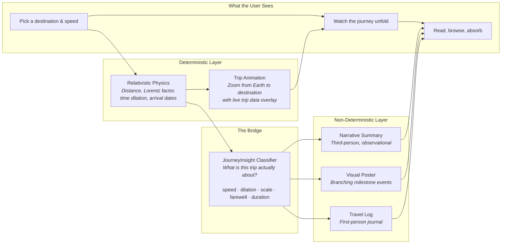
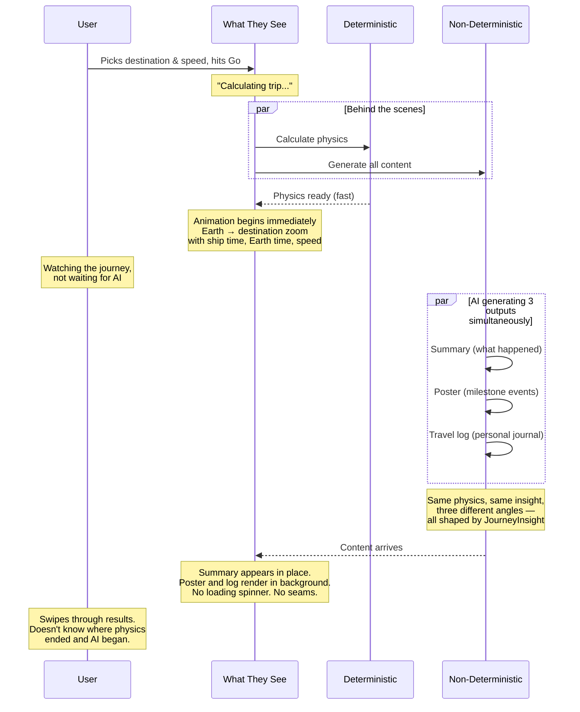

# KG Velocity — Article Diagrams

## How Deterministic and Non-Deterministic Systems Blend

```mermaid
graph LR
    subgraph User["What the User Sees"]
        Pick["Pick a destination & speed"]
        Movie["Watch the journey unfold"]
        Results["Read, browse, absorb"]
    end

    Pick --> Movie --> Results

    subgraph Deterministic["Deterministic Layer"]
        Physics["Relativistic Physics<br/><i>Distance, Lorentz factor,<br/>time dilation, arrival dates</i>"]
        Animation["Trip Animation<br/><i>Zoom from Earth to destination<br/>with live trip data overlay</i>"]
    end

    subgraph Bridge["The Bridge"]
        Insight["JourneyInsight Classifier<br/><i>What is this trip actually about?</i><br/><br/>speed · dilation · scale · farewell · duration"]
    end

    subgraph NonDeterministic["Non-Deterministic Layer"]
        Summary["Narrative Summary<br/><i>Third-person, observational</i>"]
        Poster["Visual Poster<br/><i>Branching milestone events</i>"]
        TravelLog["Travel Log<br/><i>First-person journal</i>"]
    end

    Pick --> Physics
    Physics --> Animation
    Physics --> Insight
    Insight --> Summary
    Insight --> Poster
    Insight --> TravelLog
    Animation --> Movie
    Summary --> Results
    Poster --> Results
    TravelLog --> Results
```

## What the User Experiences vs. What's Actually Happening

```mermaid
sequenceDiagram
    participant User
    participant App as What They See
    participant Det as Deterministic
    participant AI as Non-Deterministic

    User->>App: Picks destination & speed, hits Go

    Note over App: "Calculating trip..."

    par Behind the scenes
        App->>Det: Calculate physics
        App->>AI: Generate all content
    end

    Det-->>App: Physics ready (fast)

    Note over App: Animation begins immediately<br/>Earth → destination zoom<br/>with ship time, Earth time, speed

    Note over User: Watching the journey,<br/>not waiting for AI

    par AI generating 3 outputs simultaneously
        AI->>AI: Summary (what happened)
        AI->>AI: Poster (milestone events)
        AI->>AI: Travel log (personal journal)
    end

    Note over AI: Same physics, same insight,<br/>three different angles —<br/>all shaped by JourneyInsight

    AI-->>App: Content arrives

    Note over App: Summary appears in place.<br/>Poster and log render in background.<br/>No loading spinner. No seams.

    Note over User: Swipes through results.<br/>Doesn't know where physics<br/>ended and AI began.
```
